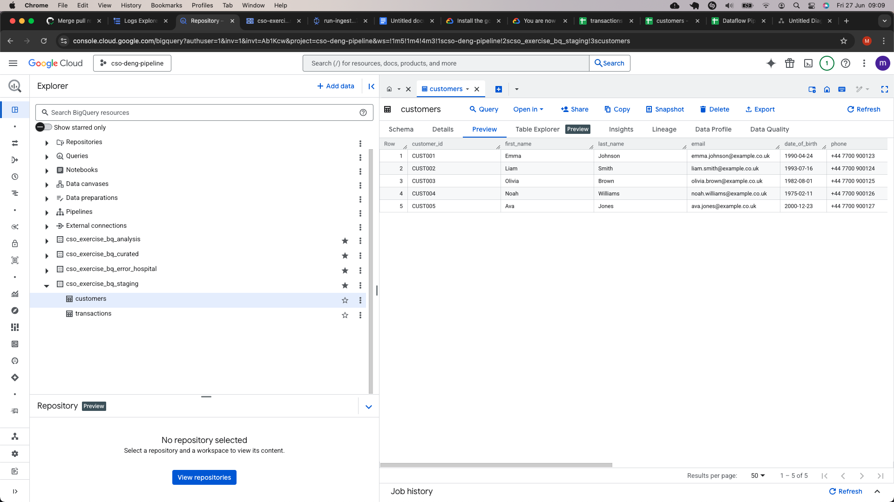

# Fully Automated GCP Data Ingestion Pipeline

This repository provides a simple fully automated end-to-end data ingestion and processing pipeline on Google Cloud Platform (GCP). It has been built in a user friendly way so that in theory it could be used in a real world scenario with minimal set-up and preparation required. 

Built using Infrastructure as Code (Terraform) and CI/CD (GitHub Actions), this system lets you ingest, validate, cleanse and analyse CSV data files by simply pushing them to the repository. Everything else — from infrastructure provisioning to data validation, loading, and BigQuery SQL processing — is handled automatically.

## Use Case

This project is ideal for:

- Data teams who want a hands-free ingestion system.
- Engineers looking to enforce schema validation before loading into BigQuery.
- Analysts who want curated datasets and auto-run SQL reports.
- Developers building reproducible, version-controlled data pipelines.
- Anyone deploying repeatable data ingestion environments using Terraform and CI/CD.

## High-Level Architecture

### Pipeline Architecture 

[Dataflow Pipeline Architecture](https://drive.google.com/file/d/1QGmuwqxD3UBUQJ5AgricvbpJedL0bALR/view?usp=sharing)

### GCP Layers

**GCS**
- Raw layer of data, accepts any input as long as it is a valid csv

**BQ Schema Layers**

- **Staging**  
  Contains raw, valid data ingested directly from the pipeline.

- **Error Hospital**  
  Stores invalid records along with detailed error messages.

- **Curated (optional)**  
  Contains cleaned or processed data produced by optional SQL scripts.

### Repository Structure:
Got it! Here's your exact directory structure formatted cleanly for Markdown using a code block. This keeps your original indentation and layout exactly as you pasted it:

<pre><code>
├── assets
│   ├── picture1
│   └── picture2
│   └── etc....
├── Dockerfile
├── README.md
├── data
│   ├── customers.csv
│   └── transactions.csv
├── functions
│   ├── main.py
│   └── requirements.txt
├── gcp-terraform
│   ├── function-source.zip
│   ├── main.tf
│   ├── outputs.tf
│   ├── terraform.tfstate
│   ├── terraform.tfstate.1750358483.backup
│   ├── terraform.tfstate.1750358491.backup
│   ├── terraform.tfstate.backup
│   ├── terraform.tfvars
│   └── variables.tf
├── mappings.yaml
├── metadata.json
├── pipelines
│   └── cso_dataflow_pipeline.py
├── schemas
│   ├── customers_schema.json
│   └── transactions_schema.json
└── sql
    ├── analysis
    │   ├── customer_monthly_spend.sql
    │   └── top_5_pct_lifetime_value.sql
    └── clean_and_test
        ├── customers.sql
        └── transactions.sql
</code></pre>

### Repository Structure Detail

#### Root Files

- Dockerfile  
  Defines the container image used for the Dataflow Flex Template job, specifying dependencies and entrypoint.

- README.md  
  Provides user instructions, setup steps, and overall project documentation.

- mappings.yaml  
  Stores mapping logic (e.g., column mappings, field renames) used by the pipeline to transform raw data.

- metadata.json  
  Describes datasets, tables, or other metadata the pipeline needs (e.g., table schema info or load configuration).

#### assets/ - Process Pictures 

- Pictures detailing the process flow for ReadME purposes

#### data/ — Input Files

- eg: customers.csv / transactions.csv  (In this exercise)
  Example input files that are uploaded to GCS and ingested by the pipeline.

#### functions/ — Cloud Function Source

- main.py  
  Source code for the Cloud Function that listens to GCS file uploads and triggers the Dataflow job via Pub/Sub or REST API.

- requirements.txt  
  Python dependencies for the Cloud Function.

#### gcp-terraform/ — Infrastructure-as-Code

- main.tf, variables.tf, outputs.tf, terraform.tfvars  
  Define and configure GCP resources (GCS bucket, Pub/Sub, Cloud Function, BigQuery datasets, Dataflow job config).

- terraform.tfstate*  
  Tracks the current deployed infrastructure state (auto-managed by Terraform).

- function-source.zip  
  Deployment package for the Cloud Function containing zipped source and dependencies.

#### pipelines/ — Dataflow Job

- cso_dataflow_pipeline.py  
  Apache Beam pipeline:  
    - Reads CSV files from GCS  
    - Parses filename to match schema  
    - Validates data using JSON schema 
    - Performs basic NULL checks 
    - Loads valid data to BigQuery staging tables  
    - Sends invalid records to error hospital  

#### schemas/ — Data Validation Rules

- eg: customers_schema.json / transactions_schema.json (In this exercise)
  JSON schemas used to validate the structure and types of incoming CSV records before they are loaded to BigQuery.

#### sql/ — BigQuery SQL Scripts

- clean_and_test/  
  Post-ingestion SQL scripts used to:  
  - Clean staging tables  
  - Perform basic data integrity checks (e.g., nulls, duplicates)  
  - Prepares data for curation

  eg: customers.sql / transactions.sql: Cleaning logic specific to each entity

- analysis/  
  Analytical SQL scripts to extract business insights after the data is curated

  customer_monthly_spend.sql: Calculates monthly spend per customer  
  top_5_pct_lifetime_value.sql: Identifies top 5% customers by lifetime value

## Run Guide

**If using the full pipeline moving data from a local source to BQ then start at step 1**
**If only wanting to create an analysis view then skip to step 5**
**Naming convention of the files must be consistent throughout eg: customers.cvs/customers.json/customers.sql**

1) User clones the repo

2) User creates a feature branch off main

3) User adds a csv to data/ to be pushed through the pipeline 

4) User adds a corresponding schema to validate the csv added to schemas/

5) User adds a .sql script to clean_and_test if the data needs to eventually land in the curated layer 

    (skip if it only needs to land in the staging area)

6) User adds any infrastructure required to main.tf (this would be controlled at an organisation)

7) If a user wants to add an analysis view/materialised view/table then add a .sql file to sql/analysis

7) User then pushes the feature branch to main triggering the github action sequence

## Process Flow

Expected Run Time: ~ 11 minutes
Costs for Pipeline (with small usage): Negligable 

**User Input**
- User Git Push

**GitHub Actions CI/CD:**  
- Authenticates to GCP
- Sets up Google Cloud CLI
- Packages Cloud Function
- Sets Ap Terraform
- Initialises & Applys Terraform Deploying GCP Infrastructure
- Builds & Pushes Flex Template Image
- Creates Flex Template JSON
- Uploads Function Code
- Reads Changes CSV and Analysis SQL Files
- Lists Changed CSV Files
- Uploads Changed CSV and Schema Files to GCS
- Uploads Mapping Config to GCS
- Triggers Dataflow Job for Changed CSVs
- Waits for Dataflow Job to Complete
- Runs Cleaning and Testing SQL Scripts
- Runs Analysis SQL Scripts
- Job Completes 

## Visual Run Example

## Assumptions

This project is built with several assumptions to simplify design and deployment. Understanding these will help determine whether the pipeline suits a project's needs or whether further modifications are required.

### Project Handling

- **Running the project**
  This project was ran by a single engineer, testing was limited to that one person. In a real environment thorough peer reviews and testing would be required
- **Pull Requests**
  Pull requests are automatically merged to main, in a proper environment, main should be protected and a secondary feature branch should be used to push changes to for running the pipeline

### File Format and Naming

- **CSV files only**  
  The pipeline accepts input data in CSV format only. Other formats such as JSON, Parquet, or Avro are not supported.

- **One schema per file**  
  Each CSV file must have a corresponding JSON schema file with the same base filename.  
  Example: `customers.csv` should have `customers.json`.

- **File naming convention**  
  The name of the CSV file determines which schema to use and which BigQuery table to load into.

### Schema Validation

- JSON schema files define required fields, data types, and formats.
- Validation occurs within the Dataflow pipeline before loading data into BigQuery.
- Records that fail validation are redirected to a separate error hospital table.
- Each Schema is user generated so isn't automated to a standard process or procedure

### BigQuery Dataset Layers

- **Staging**  
  Contains valid data ingested directly from the pipeline with minimal cleansing and testing

- **Error Hospital**  
  Stores invalid records along with detailed error messages.

- **Curated (optional)**  
  Contains the cleaned "Gold Layer" of data, a.k.a. analytically ready data

### Infrastructure Automation

- All GCP infrastructure is provisioned using Terraform.
- GitHub Actions automates the deployment process.
- No manual infrastructure setup or configuration is needed.

### CI/CD Workflow

- All deployment and ingestion steps are triggered automatically when changes are merged into the `main` branch.
- No manual steps are required.

### Resource Usage and Cost

- The pipeline is designed to be low-cost.
- Dataflow jobs only run when new files are uploaded.
- There are no continuously running or always-on components.
- The process uses a batch pipeline to reduce costs

### Security

- Uses a service account with permissions limited to only the required GCP services.
- Credentials are stored securely using GitHub Secrets.

### Scalability

- Suitable for batch ingestion of small to moderate data volumes.
- Not optimized for high-volume or streaming workloads.

### Extensibility

- The system supports multiple datasets being processed in parallel.

## Future Improvements

### 1. Input Format Flexibility

- **Support for additional file formats**  
  Extend the pipeline to accept other formats such as JSON, Parquet, or Avro.
- **Automatic format detection**  
  Implement logic to detect the file type and route processing accordingly.
-**Explore an approach to ingress data from various source**
  Extend the ingress capabilities from local files, in a productionised capacity everything should be in gcs
-**Improve file naming**
  Explore concatenating the date to make file names unqiue

### 2. Schema Matching Improvements

- **Decouple schema matching from strict filenames**  
  Allow schema-to-file mapping via a config file or metadata, instead of requiring filename matches.
- **Support schema versions**  
  Introduce versioning in schema files and infer correct versions based on naming or file headers.

### 3. Validation Enhancements

- **Advanced schema features**  
  Add support for regex patterns, enums, minimum/maximum values, and other JSON Schema validations.
- **Data summaries and quality checks**  
  For testing purposes in production summary data cand data quality checks should be taken of the data
- **Mapping documentation**  
  Create mapping documents with a full picture of the data landscape

### 4. Monitoring and Alerting

- **Cloud Logging and Error Metrics**  
  Enhance observability by logging detailed metrics for ingestion success/failure.
- **Slack or Email notifications**  
  Trigger alerts for failed jobs, data validation errors, or missing files.

### 5. Reporting

- **Dashboards**  
  Integrate with Looker Studio or another BI tool to visualize ingested data and metrics.
- **Integrating GenAI**
  Integrate google's Gemini into Looker to generate dashboards, reccomend insights, summarise trend and derive narratives from the data

### 6. Storage and Triggering Enhancements

- **Dynamic folder support**  
  Allow organized file uploads in nested GCS folders (e.g., by date or dataset name).
- **Multiple GCS buckets**  
  Support separation of raw, processed, and archived data using different buckets or prefixes.
- **Streaming input support**  
  Optionally add support for near real-time data using Pub/Sub streams and windowing.

### 7. Deployment and Documentation

- **More robust documentation**  
  Utilise sites like confulence to properly document the pipeline thoroughly for reusability 
- **Mapping and lineage documents**  
  Include source-to-target data mapping documents and data lineage overviews.
- **Templated repo setup**  
  Provide a script or GitHub template repo to easily bootstrap a new ingestion project.

### 8. Orchestration & Workflow Management

- **Explore scheduled processing if in scope**
  Integrate Cloud Composer (Apache Airflow) or Google Workflows to orchestrate complex data pipelines with dependencies, retries, and scheduling.

### 9. Scalability & Cost Optimization

- **Methods to adhere to scalability and cost optimisation**
 Add dynamic scaling of Dataflow workers based on workload.
 Enforce data partitioning and clustering in BigQuery to improve query performance and reduce cost.

### 10. User Experience & Extensibility

- **Improving the experience of the user and growth of the product**
- Build a web interface or CLI tool to upload CSVs and schemas, monitor pipeline status, and visualize errors.
- Implement multiple environments for dev,uat and production
- Provide audit logging and compliance reports.

## Additional Documentation

[Data Dictionary](https://docs.google.com/spreadsheets/d/1TDQT-YCTws1CYmgt0EbepnbJ7Hlk-mMC_npQRJcBcQo/edit?usp=sharing)
